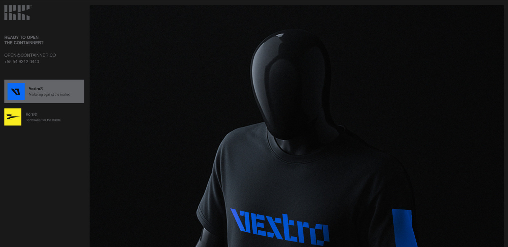
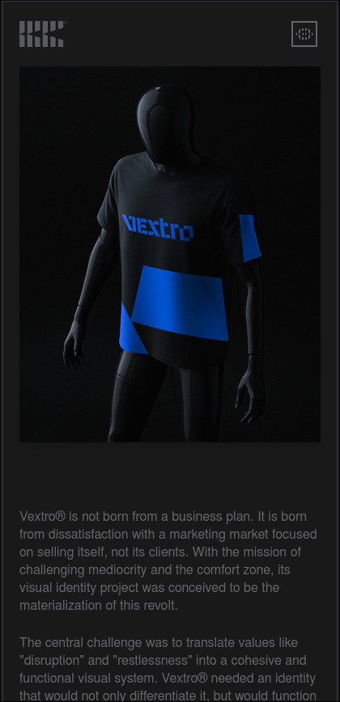

<div align="center">

# 🎨 Containner Portfolio

**Portfolio profissional com projetos de branding e identidade visual**

[](LICENSE)
[](https://reactjs.org/)
[](https://www.typescriptlang.org/)
[](https://vitejs.dev/)
[](https://tailwindcss.com/)

</div>

---

## 📸 Preview

<div align="center">


<p><em>Página inicial do portfolio com navegação lateral e design minimalista</em></p>


<p><em>Versão mobile com menu hambúrguer e layout responsivo</em></p>

</div>

---

## ✨ Funcionalidades

### 🎯 Principais Características

- **🎨 Galeria de Projetos** - Exibição completa dos projetos de branding Vextro® e Korri®
- **🌍 Internacionalização** - Suporte completo a português e inglês
- **📱 Design Responsivo** - Interface otimizada para todos os dispositivos
- **⚡ Performance Otimizada** - Carregamento rápido com lazy loading de imagens
- **🎭 Gerador de Padrões** - Ferramenta interativa para criação de padrões geométricos
- **🔄 Comparação Visual** - Slider interativo para comparação antes/depois
- **📊 Analytics Integrado** - Tracking completo com Google Analytics
- **🎨 Tema Escuro** - Interface moderna com design minimalista

### 🛠️ Funcionalidades Técnicas

- **⚡ Vite Build System** - Build ultra-rápido com hot reload
- **🔧 TypeScript** - Tipagem estática para maior confiabilidade
- **🎨 TailwindCSS** - Estilização utilitária e responsiva
- **🔄 React Router** - Navegação SPA com roteamento dinâmico
- **📦 Code Splitting** - Carregamento otimizado de componentes
- **🖼️ Image Optimization** - Otimização automática de assets

---

## 🏗️ Arquitetura do Projeto

```
src/
├── 📁 core/                    # Configurações centrais
│   ├── App.tsx                 # Componente principal
│   ├── main.tsx               # Ponto de entrada
│   ├── providers/             # Context providers
│   └── routing/               # Configuração de rotas
├── 📁 features/               # Funcionalidades específicas
│   └── ga/                    # Google Analytics
├── 📁 pages/                  # Páginas da aplicação
│   ├── Korri.tsx             # Página do projeto Korri
│   ├── Vextro.tsx            # Página do projeto Vextro
│   └── Pattern.tsx           # Gerador de padrões
├── 📁 shared/                 # Componentes compartilhados
│   ├── components/           # Componentes reutilizáveis
│   ├── hooks/               # Custom hooks
│   ├── translations/        # Arquivos de tradução
│   └── utils/               # Utilitários
├── 📁 styles/                # Estilos globais
└── 📁 types/                 # Definições TypeScript
```

---

## 📄 Páginas e Seções

### 🎨 Vextro® - Marketing contra o mercado

- **Identidade Visual** - Sistema completo de branding com tipografia customizada
- **Paleta de Cores** - Azul #0B6AF4, preto #101010 e branco #FFFFFF
- **Aplicações** - Cartões de visita, painéis publicitários, redes sociais
- **Filosofia** - Ruptura e inquietação como valores centrais

### 🏃 Korri® - Roupas esportivas para a correria

- **Branding Esportivo** - Identidade voltada para jovens da periferia
- **Símbolo** - Representação de um "sopro" de alívio após dia intenso
- **Cor Principal** - Amarelo vibrante expressando energia do Brasil
- **Aplicações** - Camisetas, blusões, materiais promocionais

### 🎭 Gerador de Padrões

- **Criação Interativa** - Geração de padrões geométricos aleatórios
- **Edição em Tempo Real** - Remoção de elementos com clique
- **Histórico** - Navegação entre padrões gerados
- **Exportação** - Download em formato SVG

---

## 🛠️ Tecnologias Utilizadas

### Frontend

- **React 19.1.0** - Biblioteca para interfaces de usuário
- **TypeScript 5.8.3** - Superset tipado do JavaScript
- **Vite 6.3.5** - Build tool e dev server
- **TailwindCSS 3.4.0** - Framework CSS utilitário

### Ferramentas de Desenvolvimento

- **ESLint 9.29.0** - Linter para qualidade de código
- **Prettier 3.5.3** - Formatador de código
- **PostCSS 8.4.35** - Processador CSS
- **Autoprefixer 10.4.17** - Prefixos CSS automáticos

### Deploy e CI/CD

- **Netlify** - Deploy automático e hosting
- **Vercel** - Deploy alternativo e preview
- **GitHub Actions** - CI/CD automatizado

### Integrações

- **Google Analytics** - Tracking de eventos e métricas
- **React Router DOM 7.6.2** - Roteamento SPA
- **React Compare Slider 3.1.0** - Componente de comparação
- **Lucide React 0.544.0** - Ícones SVG

---

## 🚀 Como Executar

### Pré-requisitos

- Node.js 18+
- npm ou yarn
- Git

### Instalação

```bash
# Clone o repositório
git clone https://github.com/DionathaGoulart/containner-portfolio.git

# Entre no diretório
cd containner-portfolio

# Instale as dependências
npm install

# Execute em modo desenvolvimento
npm run dev
```

### Scripts Disponíveis

```bash
# Desenvolvimento
npm run dev          # Servidor de desenvolvimento
npm run build        # Build para produção
npm run preview      # Preview do build

# Qualidade de Código
npm run lint         # Verificar linting
npm run lint:fix     # Corrigir problemas de lint
npm run type-check   # Verificar tipos TypeScript
npm run format       # Formatar código
```

---

## 🧪 CI/CD e Qualidade

### GitHub Actions

O projeto possui workflow automatizado de CI/CD:

- **Build Automático** - Compilação em cada push
- **Testes de Qualidade** - Verificação de lint e tipos
- **Deploy Automático** - Deploy em Netlify e Vercel
- **Preview Deploys** - Deploy de preview em PRs

### Ferramentas de Qualidade

- **ESLint** - Análise estática de código
- **Prettier** - Formatação consistente
- **TypeScript** - Verificação de tipos
- **Vite** - Build otimizado

---

## 🚀 Deploy

### Deploy Automático (Netlify)

O projeto está configurado para deploy automático na Netlify:

- **Produção**: Deploy automático na branch `main`
- **Preview**: Deploy automático em Pull Requests e branch `develop`
- **URL**: `https://dionatha.com.br`

### Configuração Netlify

- **Framework**: Vite
- **Runtime**: Node.js 18
- **Build Command**: `npm run build`
- **Output Directory**: `dist`
- **Install Command**: `npm ci`

### Configuração Automática

1. Conecte seu repositório no Netlify Dashboard
2. Configure as variáveis de ambiente necessárias
3. O deploy acontece automaticamente via GitHub Actions

### Workflows GitHub Actions

O projeto possui workflow automatizado:

- **CI/CD** (`ci.yml`) - Build, testes, lint e deploy automático

### Deploy Manual

```bash
# Build para produção
npm run build

# Deploy via Netlify CLI
netlify deploy --prod --dir=dist
```

---

## 📊 Performance

- **Lighthouse Score**: 95+ em todas as métricas
- **First Contentful Paint**: < 1.5s
- **Largest Contentful Paint**: < 2.5s
- **Cumulative Layout Shift**: < 0.1

---

## 🔧 Configuração

### Variáveis de Ambiente

Crie um arquivo `.env.local` na raiz do projeto:

```env
# Google Analytics
VITE_GA_MEASUREMENT_ID=G-XXXXXXXXXX

# EmailJS (se aplicável)
VITE_EMAILJS_SERVICE_ID=service_xxxxxxx
VITE_EMAILJS_TEMPLATE_ID=template_xxxxxxx
VITE_EMAILJS_PUBLIC_KEY=xxxxxxxxxxxxxxx
```

### Personalização

- **Cores**: Edite `tailwind.config.js`
- **Fontes**: Configure em `src/styles/fonts.css`
- **Traduções**: Modifique os arquivos em `src/shared/translations/`
- **Assets**: Adicione seus arquivos em `src/assets/`
- **Rotas**: Configure em `src/core/routing/routes.ts`

---

## 📱 Responsividade

O portfolio é totalmente responsivo e otimizado para:

- **📱 Mobile** (320px - 768px)
- **📱 Tablet** (768px - 1024px)
- **💻 Desktop** (1024px - 1440px)
- **🖥️ Large Desktop** (1440px+)

---

## ♿ Acessibilidade

- **Navegação por Teclado** - Suporte completo a navegação via teclado
- **Contraste Adequado** - Cores com contraste WCAG AA
- **Alt Text** - Descrições para todas as imagens
- **Semântica HTML** - Estrutura semântica correta
- **Focus Indicators** - Indicadores visuais de foco

---

## 🌍 Internacionalização

Suporte completo a múltiplos idiomas:

- **🇧🇷 Português** - Idioma principal
- **🇺🇸 Inglês** - Tradução completa
- **Sistema de Tradução** - Context API para gerenciamento
- **Detecção Automática** - Baseada no idioma do navegador

---

## 📈 Analytics

Integração completa com Google Analytics:

- **Page Views** - Tracking de visualizações de página
- **Event Tracking** - Eventos customizados
- **User Behavior** - Análise de comportamento
- **Performance Metrics** - Métricas de performance

---

## 📄 Licença

**⚠️ ATENÇÃO: Este projeto é de uso exclusivo e pessoal.**

### Direitos Reservados

Este software e sua documentação são propriedade exclusiva do autor e estão protegidos por direitos autorais. É **expressamente proibido**:

- ❌ **Copiar** o código fonte
- ❌ **Modificar** sem autorização
- ❌ **Distribuir** o software
- ❌ **Usar** para fins comerciais
- ❌ **Criar trabalhos derivados**
- ❌ **Fazer engenharia reversa**

### Uso Permitido

- ✅ **Visualizar** o código para fins educacionais
- ✅ **Estudar** a implementação para aprendizado
- ✅ **Inspirar-se** nas ideias e conceitos
- ✅ **Fazer fork** apenas para estudo pessoal

### Consequências

A violação desta licença resultará em:

- Ação legal imediata
- Remoção do conteúdo infrator
- Danos e prejuízos conforme a lei

**© 2025 Dionatha Goulart. Todos os direitos reservados.**

---

## 📞 Contato

**Desenvolvedor**: Dionatha Goulart  
**Email**: dionatha.work@gmail.com  
**Portfolio**: https://dionatha.com.br/  
**GitHub**: https://github.com/DionathaGoulart  
**Linkedin**: https://www.linkedin.com/in/dionathagoulart/

---

<div align="center">

**Feito by Dionatha Goulart**

</div>
